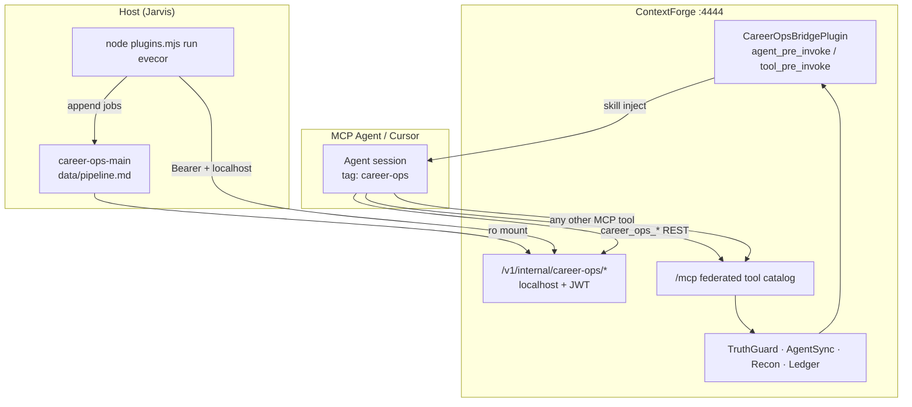

# Career-Ops ↔ ContextForge (CPEX) Integration Audit

**Audit ID:** `EVECOR-CAREEROPS-CPEX-20260630`  
**Date:** 2026-06-30  
**Auditor:** Jarvis / Cursor agent (implementation session)  
**Status:** Functional prototype — partial deploy, enablement steps outstanding  
**Scope:** career-ops Node plugin, ContextForge internal HTTP feed, CPEX `CareerOpsBridge` hook

---

## 1. Executive summary

This audit covers the EVECOR integration that connects [career-ops](https://github.com/santifer/career-ops) to ContextForge (RouterCore) so job-pipeline workflows can run through the same MCP gateway as the rest of the Jarvis tool catalog.

Three layers were built:

| Layer | Role | Status |
|-------|------|--------|
| **Internal HTTP feed** | Reads `data/pipeline.md` + `data/applications.md`, exposes JSON on localhost | Implemented, live-verified (hot-deploy) |
| **Node `plugins.local/evecor`** | CLI ingest/search for career-ops via HTTP | Scaffolded, config enabled, bearer token not persisted in `.env` |
| **CPEX `CareerOpsBridgePlugin`** | Injects career-ops skill on agent invoke; bearer auth for `career_ops_*` REST tools | Implemented, unit-tested, **disabled** in live config |

**Key architectural finding:** CPEX plugins govern and enrich tool/agent invocations; they **do not register tools**. Access to “all tools on the server” comes from connecting agents to ContextForge MCP (`/mcp`), which federates the full catalog. The bridge plugin adds career-ops-specific guidance and authenticates native feed tools — it is not a tool registry.

**Overall posture:** Read-only feed from host-mounted markdown, localhost-only HTTP binding, JWT bearer on internal routes, optional CPEX gates (TruthGuard, AgentSync, Recon, Ledger) on all MCP tool calls. Suitable for local Jarvis use; not production-hardened until remaining blockers are closed.

---

## 2. Scope and boundaries

### In scope

- RouterCore `career_ops_feed_service.py`, `career_ops_router.py`, config, compose volume mount
- CPEX plugin `plugins/career_ops_bridge/` and `plugins/config.yaml` entry
- career-ops upstream sync + `plugins.local/evecor/` scaffold
- Unit tests for feed parsing and CPEX bridge behaviour
- End-to-end verification: feed JSON → Node plugin → `data/pipeline.md` append

### Out of scope

- career-ops upstream plugins (`plugins/apify`, `gmail`, `notion`) — unchanged
- Registering `career_ops_ingest` / `career_ops_search` in gateway admin (documented, not executed)
- Permanent container rebuild (`docker compose up --build` blocked on missing `DB_PASSWORD`)
- AgentSync skill staging batch promotion
- Production retention, consent, or multi-tenant isolation policies

### Terminology

| Term | Meaning |
|------|---------|
| **CPEX** | ContextForge plugin framework (`tool_pre_invoke`, `agent_pre_invoke`, …) |
| **career-ops plugin** | Node.js opt-in integration under `plugins/` or `plugins.local/` |
| **ContextForge / RouterCore** | MCP gateway on `:4444` |
| **Internal feed** | FastAPI routes under `/v1/internal/career-ops/*` |

---

## 3. Architecture



**Data flow — CLI path (operational today):**

1. Operator runs `node plugins.mjs run evecor [search "…"]`.
2. Node plugin calls `GET /v1/internal/career-ops/jobs` or `/search?q=…` with `ROUTERCORE_MCP_BEARER_TOKEN`.
3. Gateway parses markdown → JSON `{ jobs: [...], meta: {...} }`.
4. Plugin appends unchecked jobs to `data/pipeline.md`.

**Data flow — MCP agent path (requires enablement):**

1. Agent connects to ContextForge MCP; receives full federated tool list.
2. Session tagged `career-ops` (or `activation.always_on`) → CPEX injects skill into `system_prompt`.
3. Agent invokes `career_ops_ingest` / `career_ops_search` (once registered as REST tools).
4. CPEX `tool_pre_invoke` injects bearer token from ContextForge Secrets.
5. Other gateway tools (Gmail, workspace, etc.) invoked normally through MCP + CPEX gates.

---

## 4. Component inventory

### 4.1 RouterCore — internal HTTP feed

| Artifact | Path |
|----------|------|
| Feed parser | `mcpgateway/services/career_ops_feed_service.py` |
| HTTP router | `mcpgateway/routers/career_ops_router.py` |
| Router registration | `mcpgateway/main.py` |
| Settings | `mcpgateway/config.py` (`career_ops_feed_enabled`, `career_ops_root`) |
| Compose | `compose.yml` — env + read-only volume mount |
| Unit tests | `tests/unit/mcpgateway/test_career_ops_feed.py` |

**Routes:**

| Method | Path | Auth | Network |
|--------|------|------|---------|
| GET | `/v1/internal/career-ops/jobs` | JWT bearer (`get_current_user`) | localhost only |
| GET | `/v1/internal/career-ops/search?q=` | JWT bearer | localhost only |

**Response contract:**

```json
{
  "jobs": [
    {
      "title": "string",
      "url": "string",
      "company": "string",
      "location": "string",
      "status": "string",
      "source": "string",
      "notes": "string"
    }
  ],
  "meta": {
    "source": "career-ops",
    "root": "/path/to/install",
    "count": 0,
    "pending_only": true
  }
}
```

**Parsing notes:**

- Pipeline: checkbox lines `- [ ] url | company | title | location | …`
- Processed rows with `#NNN | url | …` score/location disambiguation fixed in `_split_pipeline_tail`
- Applications: markdown table rows
- Dedupe key: job URL (case-insensitive)

### 4.2 CPEX — CareerOpsBridgePlugin

| Artifact | Path |
|----------|------|
| Plugin implementation | `plugins/career_ops_bridge/career_ops_bridge.py` |
| Bundled skill | `plugins/career_ops_bridge/skill.md` |
| Manifest | `plugins/career_ops_bridge/plugin-manifest.yaml` |
| REST tool specs (manual register) | `plugins/career_ops_bridge/gateway_tools.yaml` |
| Reference config | `plugins/career_ops.config.yaml` |
| Live config entry | `plugins/config.yaml` → `CareerOpsBridge`, **mode: disabled** |
| Unit tests | `tests/unit/mcpgateway/plugins/test_career_ops_bridge.py` |

**Hooks:**

| Hook | Trigger | Action |
|------|---------|--------|
| `agent_pre_invoke` | Session tag `career-ops` or `always_on` | Append `skill.md` + gateway-tools note to `system_prompt` |
| `tool_pre_invoke` | `career_ops_*` tool or career-ops session | Inject bearer for native tools; attach `_career_ops_context` args blob |

**Config highlights:**

```yaml
activation:
  always_on: false
  session_tags: ["career-ops"]
bearer_secret: "routercore.mcp.bearer"
fail_mode: "open"
career_ops_tools: [career_ops_ingest, career_ops_search]
```

### 4.3 career-ops — Node plugin (CLI path)

| Artifact | Path |
|----------|------|
| Install root | `/mnt/jarvis-data/projects/third-party/career-ops-main/` |
| EVECOR plugin | `plugins.local/evecor/` (`manifest.json`, `index.mjs`, `_jobs.mjs`, `skill.md`) |
| Plugin config | `config/plugins.yml` — `evecor.enabled: true` |
| Upstream sync | `@ 920a0319` from `github.com/santifer/career-ops` |

**Egress:** localhost only; `allowsLocalhost: true`, `allowedHosts: ["localhost"]`.

---

## 5. Security assessment

### 5.1 Controls in place

| Control | Implementation | Assessment |
|---------|----------------|------------|
| Network isolation | `_require_localhost()` on feed routes | **Adequate** for local-only shim |
| Authentication | JWT via `get_current_user` on feed | **Adequate** when bearer is not leaked |
| Read-only data | career-ops host mount `:ro`; feed only reads markdown | **Good** — no write-back through HTTP |
| Secret handling | CPEX reads bearer from ContextForge Secrets DB slot; not returned to agent | **Good** pattern (matches VaultCredentialPlugin) |
| Tool governance | MCP invocations subject to CPEX gate chain when enabled | **Depends on gate enablement** |
| CLI egress allowlist | career-ops plugin host restriction | **Good** |

### 5.2 Risks and gaps

| Risk | Severity | Notes |
|------|----------|-------|
| Bearer token not in career-ops `.env` | Medium | CLI path requires manual `eval` each session |
| `routercore.mcp.bearer` secret may not exist in ContextForge Secrets | Medium | CPEX auth injection fails open by default (`fail_mode: open`) |
| REST tools not registered | Low | Agents cannot call `career_ops_*` via MCP until admin step |
| CPEX plugin disabled | Low | Skill injection and auto-bearer inactive |
| Hot-deploy vs baked image | Medium | Feed code in running container may drift from git until rebuild |
| `ToolPreInvokePayload.headers` deprecated | Low | Framework migration to `extensions.http.headers` pending |
| `_career_ops_context` in tool args | Low | Skill preview (2 KB) visible in tool args metadata — not a secret leak but adds payload size |
| No rate limiting on internal feed | Low | Localhost-only mitigates |
| Processed pipeline score mis-parse | **Resolved** | Fixed in feed service during implementation |

### 5.3 Fail modes

| Component | `fail_mode: open` | `fail_mode: closed` |
|-----------|-------------------|---------------------|
| CareerOpsBridge bearer inject | Tool proceeds without auth; feed may 401 | Blocks with `CAREER_OPS_AUTH_FAILED` (503) |
| TruthGuard / AgentSync gates | Separate config; currently mixed enablement in `plugins/config.yaml` | — |

**Recommendation:** Use `fail_mode: closed` for bearer injection once `routercore.mcp.bearer` is reliably populated.

---

## 6. Configuration state (as of audit date)

| Setting | Expected | Observed |
|---------|----------|----------|
| `CAREER_OPS_FEED_ENABLED` | `true` | Set in `compose.yml` |
| `CAREER_OPS_ROOT` | `/app/career-ops-host` | Set in `compose.yml` |
| Host volume mount | career-ops-main → container | Configured in `compose.yml` |
| Feed endpoints live | 200 + JSON | Verified during implementation (Insight Global IAM Analyst data) |
| Node evecor plugin | enabled | `config/plugins.yml` |
| `ROUTERCORE_MCP_BEARER_TOKEN` in `.env` | present | **Missing** — mint via `evecor-routercore-mcp-bearer` |
| CPEX `CareerOpsBridge` | `transform` when ready | **`disabled`** |
| Gateway REST tools | registered | **Not registered** (spec in `gateway_tools.yaml` only) |
| ContextForge secret `routercore.mcp.bearer` | populated | **Unverified** |
| Permanent image rebuild | current code baked in | **Blocked** (`DB_PASSWORD` missing for compose build) |

---

## 7. Verification evidence

### 7.1 Automated tests

| Suite | Location | Result |
|-------|----------|--------|
| Feed parsing | `tests/unit/mcpgateway/test_career_ops_feed.py` | Pass (pipeline, applications, search, fixture dir) |
| CPEX bridge | `tests/unit/mcpgateway/plugins/test_career_ops_bridge.py` | **7/7 pass** (2026-06-30, RouterCore `.venv`) |

### 7.2 Manual / integration checks performed

| Check | Result |
|-------|--------|
| `GET /v1/internal/career-ops/jobs` with bearer from localhost | JSON with pending jobs |
| `GET /v1/internal/career-ops/search?q=Insight` | Matching records |
| `node plugins.mjs run evecor search "Insight"` | Appended job to `data/pipeline.md` |
| Hot-deploy into `routercore` container | Successful (temporary until rebuild) |

### 7.3 Not verified in this audit

- MCP agent session with `career-ops` tag and skill injection
- REST tool registration and MCP `tools/call` for `career_ops_*`
- CPEX bearer injection against live ContextForge Secrets
- Full compose rebuild and cold-start behaviour
- Behaviour under TruthGuard/AgentSync gates enabled in sequential mode

---

## 8. Distinction: three “plugin” concepts

Auditors and operators should not conflate:

| Name | Technology | Purpose |
|------|------------|---------|
| career-ops Node plugin | `plugins.local/evecor` (`.mjs`) | CLI ingest/search over HTTP |
| CPEX plugin | `CareerOpsBridgePlugin` (Python) | Skill injection + bearer for gateway REST tools |
| Gateway REST tools | Admin-registered `career_ops_*` | MCP-visible native career-ops operations |

None of these replace MCP federation. **Full tool catalog access** requires an MCP session to ContextForge, not CPEX registration alone.

---

## 9. Remaining blockers

1. **Persist bearer token** — Add `ROUTERCORE_MCP_BEARER_TOKEN` to career-ops `.env` (mint script: `/mnt/jarvis-data/projects/EVECOR/bin/evecor-routercore-mcp-bearer`).
2. **ContextForge secret** — Create `routercore.mcp.bearer` in encrypted secrets store matching the same token.
3. **Register REST tools** — Apply definitions from `gateway_tools.yaml` via admin UI or API.
4. **Enable CPEX plugin** — Set `CareerOpsBridge` `mode: transform` in `plugins/config.yaml`; restart gateway.
5. **Permanent deploy** — Resolve `DB_PASSWORD` (or equivalent) and rebuild `routercore` image so feed + CPEX code is not hot-patch only.
6. **Session tagging** — Ensure career-ops MCP agents carry gateway tag `career-ops`, or set `activation.always_on: true` (broader blast radius).

---

## 10. Recommendations

### Immediate (local Jarvis)

1. Complete blockers 1–4 above in order.
2. Run one MCP agent test: tagged session → `tools/list` includes `career_ops_*` → invoke search → confirm JSON result.
3. Set `fail_mode: closed` on bearer injection after secret is confirmed stable.

### Short term

1. Add a smoke script under `RouterCore/plugins/career_ops_bridge/` that curls feed endpoints and checks JSON schema.
2. Migrate bearer header injection to `extensions.http.headers` when CPEX deprecates `ToolPreInvokePayload.headers`.
3. Document gateway tag assignment for Cursor/Agent sessions in `career-ops-main/plugins.local/evecor/README.md`.

### Longer term (optional)

1. Wrap career-ops CLI as a registered MCP server on ContextForge for direct CPEX gating of CLI operations.
2. Replace markdown read with AgentSync/Datacore pipeline state if multi-agent coordination is required.
3. Add integration test that registers REST tools in test DB and exercises full MCP call path.

---

## 11. File manifest (authoritative paths)

```
/mnt/jarvis-data/projects/EVECOR/RouterCore/
├── mcpgateway/services/career_ops_feed_service.py
├── mcpgateway/routers/career_ops_router.py
├── mcpgateway/config.py                    # career_ops_* settings
├── mcpgateway/main.py                      # router include
├── compose.yml                             # mount + env
├── plugins/config.yaml                     # CareerOpsBridge entry (disabled)
├── plugins/career_ops.config.yaml          # reference copy
├── plugins/career_ops_bridge/
│   ├── AUDIT.md                            # this document
│   ├── README.md
│   ├── career_ops_bridge.py
│   ├── skill.md
│   ├── gateway_tools.yaml
│   └── plugin-manifest.yaml
└── tests/unit/mcpgateway/
    ├── test_career_ops_feed.py
    └── plugins/test_career_ops_bridge.py

/mnt/jarvis-data/projects/third-party/career-ops-main/
├── plugins.local/evecor/
├── config/plugins.yml                      # evecor enabled
└── data/pipeline.md                        # feed source

/mnt/jarvis-data/projects/EVECOR/bin/
└── evecor-routercore-mcp-bearer            # token mint helper
```

---

## 12. Sign-off

| Criterion | Met? |
|-----------|------|
| Internal feed implemented and tested | Yes |
| Localhost + JWT enforcement | Yes |
| CPEX bridge implemented and unit-tested | Yes |
| MCP federated catalog access documented | Yes |
| Production-ready / fully enabled | **No** |
| Permanent container deploy | **No** |

**Conclusion:** The career-ops ↔ ContextForge integration is architecturally sound for local EVECOR use. The HTTP feed and CPEX bridge are implemented and tested; operational enablement (secrets, REST tool registration, plugin mode, rebuild) remains incomplete. Treat as an audited prototype until blockers in §9 are closed.

---

*End of audit `EVECOR-CAREEROPS-CPEX-20260630`*
